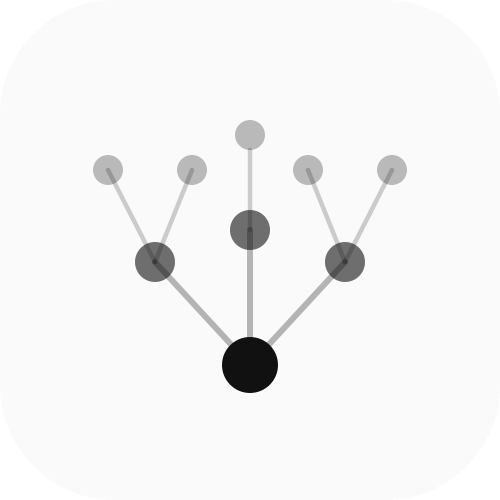
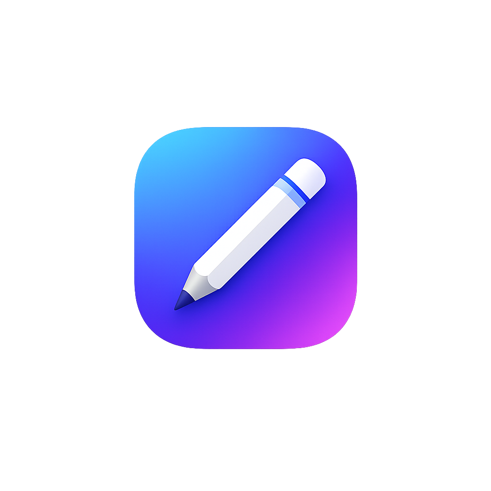

<div align="center">


<br/>

[](https://git.io/typing-svg)

<br/>


[](https://github.com/shivamk-tech)

</div>

---


##  About Me

```javascript
const shivam = {
  status:     "Creating bugs since 4 months",
  learning:   ["Web Dev", "AI/ML", "System Design"],
  goal:       "Land a ML Engineer role",
  funFact:    "Fix 1 bug → create 3 new bugs",
  stack:      ["MERN", "Python", "Next.js"],
  openTo:     "Internships & Collabs"
};
```

<br clear="right"/>

---

##  Featured Projects

<table>
<tr>
<td width="50%" valign="top">

###  CodeClaria


**AI-powered code review platform**

Connect your GitHub repos and get intelligent PR/commit analysis. Smarter, faster feedback to level up your code quality — backed by subscription-based access control.

`AI` `GitHub API` `MERN` `LLM`

</td>
<td width="50%" valign="top">

###  Uber Clone


**Full MERN Stack ride booking app**

Real-time ride booking with live location tracking, role-based auth, and a scalable backend architecture built to handle production traffic.

`MERN` `Socket.io` `Maps API` `JWT`

</td>
</tr>
<tr>
<td width="50%" valign="top">

###  Sketcha



**Creative drawing application**

An interactive sketch-based app with a smooth, responsive canvas UI designed for intuitive and delightful drawing experiences.

`Canvas API` `React` `Tailwind`

</td>
<td width="50%" valign="top">

###  TriggerInsta


**Smart Instagram automation platform**

Automate repetitive Instagram tasks — auto-replies, lead collection, scheduled actions & engagement workflows. Analytics + automation + user interaction, all in one modern dashboard.

`Instagram API` `Automation` `MERN` `Analytics`

</td>
</tr>
</table>

---

##  Tech Stack

<div align="center">

**Languages**


**Frontend**


**Backend & DB**


**Tools**


</div>

---

##  GitHub Stats

<div align="center">


&nbsp;&nbsp;


<br/>


</div>

---

##  Contribution Graph


---

##  Currently Learning

<div align="center">

|  Topic |  Status |
|---|---|
| Advanced MERN Architecture | In Progress |
| Machine Learning Fundamentals | Learning |
| System Design Basics | Exploring |

</div>

---

##  Connect With Me

<div align="center">

[](https://www.linkedin.com/in/shivam-kumar-218777276/)
[](https://x.com/tenzin_886)
[](https://github.com/shivamk-tech)

</div>

---

<div align="center">


<br/>

**Code. Break. Learn. Repeat.**


</div>
